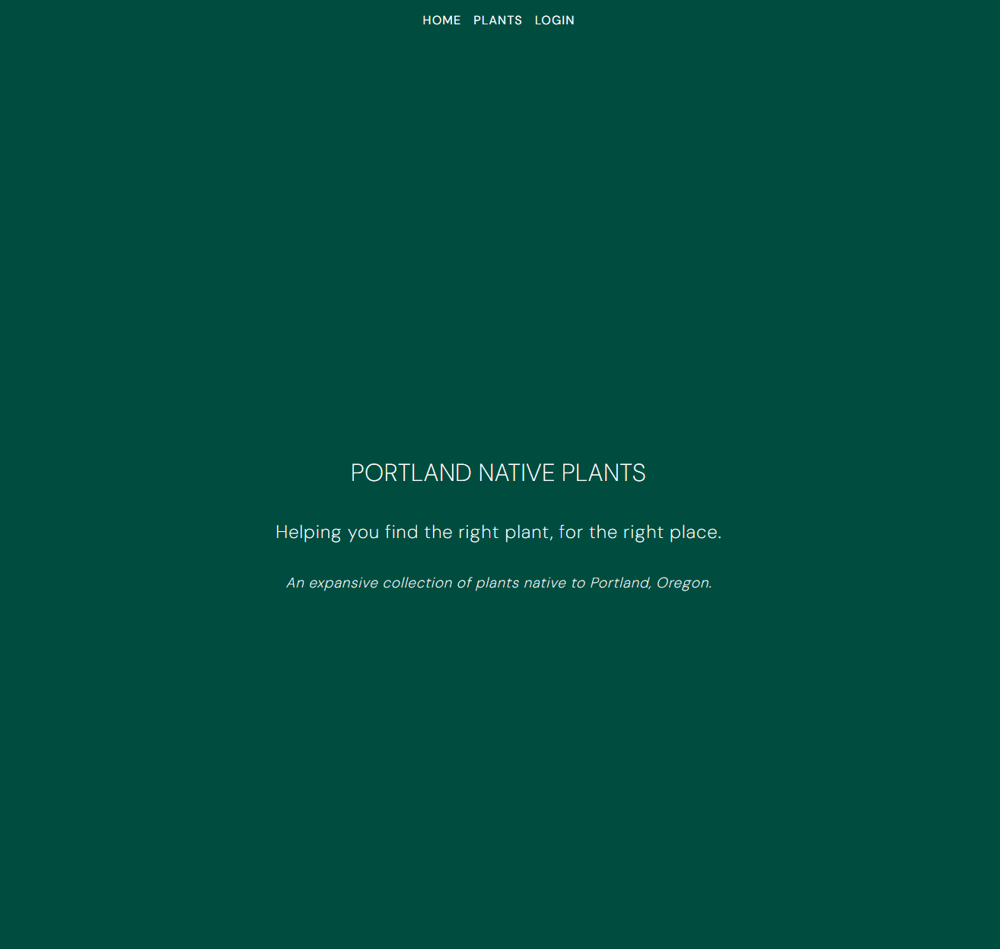

# Portland Native Plants

## Features

Portland Native Plants is an expansive resource containing plants native to Portland, Oregon.\
All of the plants on this list could be suitable for backyard habitats and restoration projects alike.  
The site allows you to: 

- search and filter plants by binomial name, common name, and type.
- sort columns alphanumerically
- modify the database with full CRUD if a contributing admin
- download and install the app on your desktop or mobile device as a Progressive Web App

### Installing the App

#### Chrome - Desktop

In the address bar, click the icon of a desktop with a down arrow to install the app. This will create an icon on your desktop.

#### Chrome - Mobile

Click the options menu and select Install App to add it as an icon on your home page.

#### iOS

Choose the Share up-arrow at the bottom of the screen, and select Add to Home Screen.

 

## Available Scripts

In the project directory, you can run:

### Backend

#### `bundle install`

#### `rails s`

Runs a local server to host the plant list data.\
Open [http://localhost:3000/species](http://localhost:3000/species) to view it in your browser.

### Frontend

#### `npm install --prefix client`

#### `npm start --prefix client`

Runs the client in development mode.\
Open [http://localhost:4000](http://localhost:4000) to view it in your browser.

The page will reload when you make changes.

## For Contributors
If you'd like to contribute to the database, please email me at codybarker.or@gmail.com. We need images!

##  Support
e: codybarker.or@gmail.com

## Project Status
In development and unlicensed

## Author
Cody Barker
https://codybarker.dev

